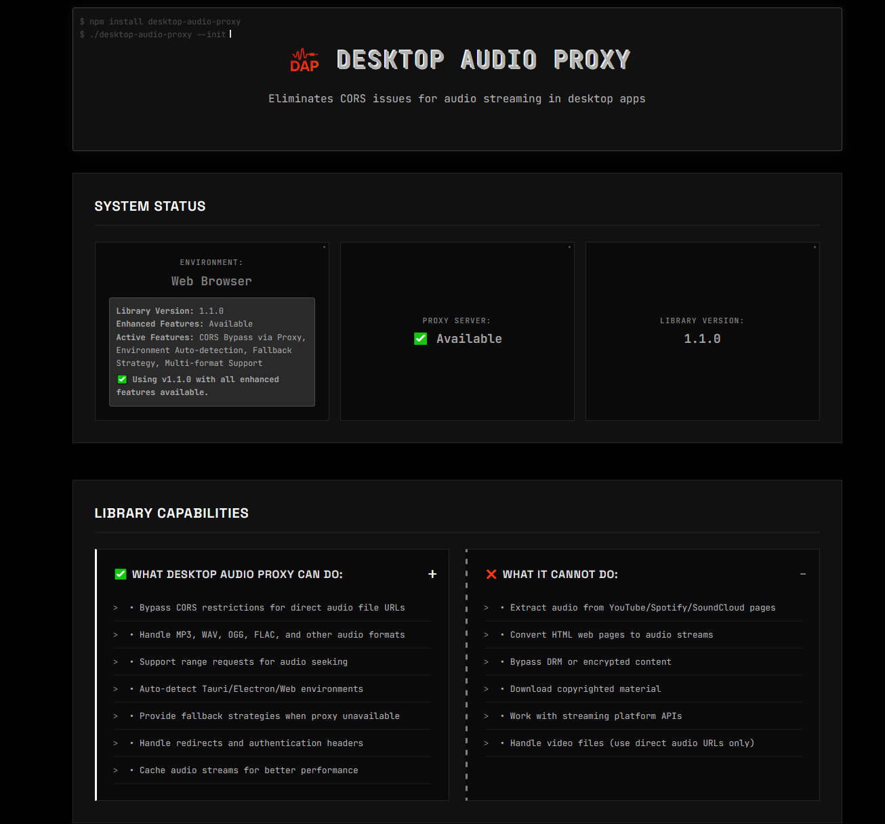
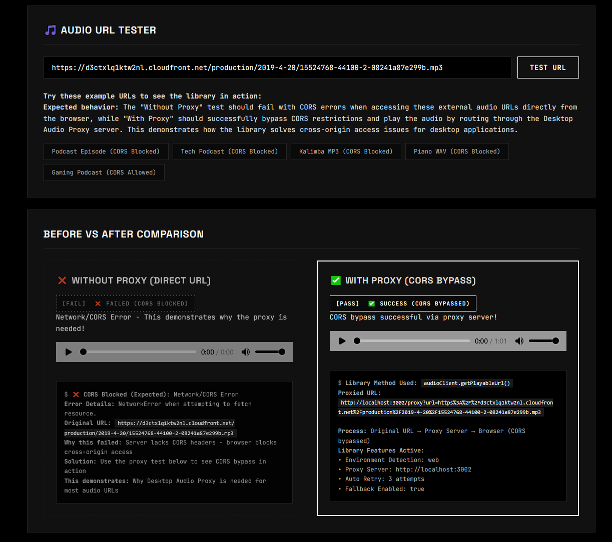
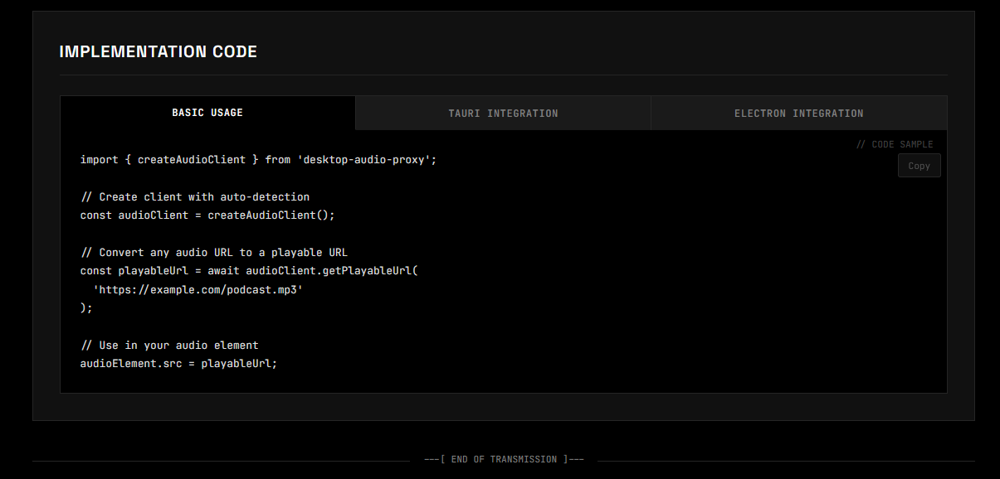
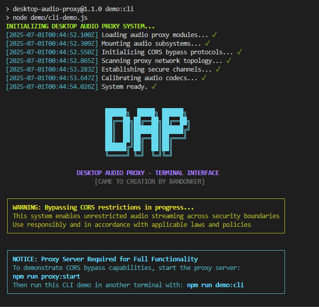
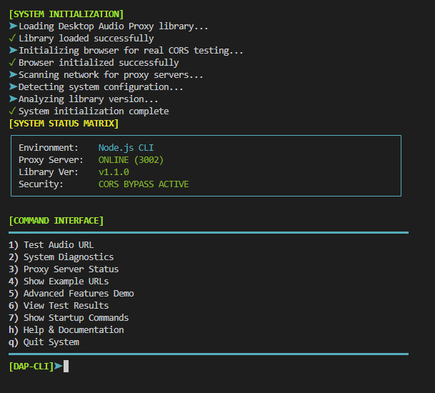
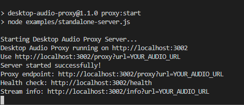

<p align="center">
  
</p>

<h1 align="center">DAP - Desktop Audio Proxy</h1>


<p align="center" style="font-size:1.1em;">
  <strong>Bypasses CORS & WebKit codec issues in Tauri and Electron audio apps with ease.</strong>
</p>

<p align="center">
  <a href="https://github.com/Bandonker/desktop-audio-proxy/actions/workflows/ci.yml">
    
  </a>
  <a href="https://www.npmjs.com/package/desktop-audio-proxy">
    
  </a>
  <a href="https://github.com/Bandonker/desktop-audio-proxy/blob/main/LICENSE">
    
  </a>
  
  
  <a href="https://codecov.io/gh/Bandonker/desktop-audio-proxy">
    
  </a>
    <a href="https://ko-fi.com/bandonker">
    
  </a>
  <a href="https://www.buymeacoffee.com/Bandonker">
    
  </a>
  <a href="https://patreon.com/Bandonker">
    
  </a>

</p>


## Features

- **CORS Bypass** - Play external audio URLs without CORS restrictions
- **Auto-Start Proxy** - Automatically spin up proxy server when needed (Node.js only)
- **Tauri v1 & v2 Support** - Works seamlessly with both Tauri versions
- **Debug Logger** - Multi-level logging with category filtering for troubleshooting
- **Telemetry System** - Optional performance monitoring and event tracking
- **React/Vue Integration** - Ready-to-use hooks and composables for seamless framework integration
- **Enhanced Codec Detection** - Comprehensive format testing with real-time capabilities mapping
- **Audio Metadata Extraction** - Get duration, format, bitrate from audio files
- **Audio Device Enumeration** - List and manage available audio devices
- **WebKit Compatibility** - Solves codec issues in Tauri/Electron WebView
- **Environment Detection** - Automatically detects Tauri, Electron, or web environment
- **Smart Fallbacks** - Graceful degradation when proxy unavailable
- **Actionable Error Messages** - Clear error messages with specific steps to fix issues
- **Retry Logic** - Configurable retry attempts with delays
- **Health Monitoring** - Built-in health and info endpoints
- **TypeScript** - Full type safety and IntelliSense support with JSDoc comments
- **Range Requests** - Support for audio seeking and streaming
- **Tree-Shakeable** - Optimized for smaller bundles with dead code elimination
- **Interactive Demo** - Live testing environment with auto-detection 

##  Demos

### Web Browser Demo
Visual demonstration of CORS bypass functionality in action:

<p align="center">
  
  <br><em>Complete web interface showing system status and library capabilities</em>
</p>

<p align="center">
  
  <br><em>Side-by-side comparison: Direct access fails, proxy access succeeds</em>
</p>

<p align="center">
  
  <br><em>Interactive code examples with copy-to-clipboard functionality</em>
</p>

### CLI Terminal Demo
Professional terminal interface with real-time CORS testing and browser automation:

<p align="center">
  
  <br><em>Interactive command interface with system status and real-time proxy detection</em>
</p>

<p align="center">
  
  <br><em>Real browser CORS testing with actual HTTP requests showing blocked vs allowed URLs</em>
</p>

### Proxy Server Integration
Seamless proxy server integration with automatic port detection:

<p align="center">
  
  <br><em>Live proxy server status with health monitoring and configuration details</em>
</p>

>  Try it yourself: Run `npm run demo:cli` for the terminal demo or `npm run demo` for the web demo

## The Problem

When building desktop applications with web technologies (Tauri, Electron), developers often face:

1. **CORS Issues**: External audio URLs (podcasts, radio streams) are blocked due to Cross-Origin Resource Sharing policies
2. **Codec Compatibility**: WebKit may not support certain audio codecs even with proper GStreamer plugins installed
3. **Authentication**: Some audio streams require special headers or authentication
4. **Redirects**: Many podcast/streaming URLs use multiple redirects that cause issues

## The Solution

Desktop Audio Proxy provides:

- **Automatic CORS bypass** for external audio URLs
- **Codec transcoding** support (optional, requires ffmpeg)
- **Smart redirect handling** with configurable limits
- **Automatic environment detection** (Tauri/Electron/Web)
- **Optional caching** for better performance
- **Simple API** that works like a drop-in replacement

## Installation

```bash
npm install desktop-audio-proxy
# or
yarn add desktop-audio-proxy
# or
pnpm add desktop-audio-proxy
```

## Package Exports

This library provides multiple entry points optimized for different environments:

```typescript
// Main entry - includes all functionality (client + server)
import { createAudioClient, startProxyServer } from 'desktop-audio-proxy';

// Browser-only entry - excludes server dependencies for smaller bundles
import { createAudioClient, TauriAudioService } from 'desktop-audio-proxy/browser';

// Server-only entry - for Node.js environments
import { startProxyServer, AudioProxyServer } from 'desktop-audio-proxy/server';
```

**When to use each:**
- **Main (`desktop-audio-proxy`)**: Full-stack applications, development, testing
- **Browser (`/browser`)**: Client-only applications, smaller bundle size needed
- **Server (`/server`)**: Node.js backends, standalone proxy servers, Electron main process

##  Interactive Demo 

**See Desktop Audio Proxy in action!** Our comprehensive demo provides real-time testing with automatic library detection:

```bash
npm run demo        # Start demo with auto-server
npm run demo:serve  # Serve demo on http://localhost:8080
```

**Demo Features:**
-  **Auto-Detection** - Automatically finds and loads available library builds (local, CDN, various formats)
-  **Version Detection** - Shows current library version with upgrade recommendations
-  **Enhanced Features Showcase** - Live codec detection, metadata extraction, device enumeration
-  **Real-time CORS Testing** - Compare direct URL vs proxy with live playback
-  **Developer Tools** - Exposed internals for manual testing (`window.dapDemo`)
-  **Smart Fallbacks** - Works with any version of the library
-  **Visual Upgrade Guidance** - Clear recommendations when using older versions

**What you can test:**
-  **Any audio URL** - Paste podcast, radio, or music URLs
-  **Environment detection** - See if you're in Tauri, Electron, or web
-  **Codec capabilities** - Test what formats your system supports  
-  **Metadata extraction** - View audio file information
-  **Device enumeration** - List available audio devices

**Perfect for:**
-  **Evaluating before installing** - See the value immediately
-  **Testing your URLs** - Verify compatibility before integration
-  **Learning the API** - Interactive code examples
-  **Demos and presentations** - Live proof of concept
-  **Debugging integration** - Test with your actual URLs

## CLI Demo 

**Experience the power in your terminal!** Our CLI demo features professional ASCII art and terminal effects:

```bash
npm run demo:cli
```

**Features:**
- **Sick ASCII Art** - Matrix-style banner with terminal effects
- **Real-time System Status** - Live proxy detection and version info
- **Audio URL Testing** - Compare direct vs proxy access with detailed analysis
- **System Diagnostics** - Network scanning, capability testing, version detection
- **Test Results History** - Track all your URL tests with timestamps
- **Proxy Server Monitoring** - Real-time server status and configuration
- **Interactive Help** - Built-in documentation and examples
- **Command Interface** - Easy-to-use menu system

**CLI Commands:**
```
1) Test Audio URL          - Test any audio URL with CORS bypass
2) System Diagnostics      - Check library capabilities and network
3) Proxy Server Status     - Monitor proxy server health
4) Show Example URLs       - Curated list of test URLs
5) Advanced Features Demo  - Showcase enhanced v1.1.3 features
6) View Test Results       - History of all URL tests
7) Show Startup Commands   - Display setup commands for full demo
h) Help & Documentation    - Learn about the library
q) Quit System            - Exit the CLI
```

**Perfect for:**
- **Quick testing** - Fast audio URL validation
- **Debugging** - Terminal-based diagnostics  
- **Presentations** - Professional CLI aesthetic for demos
- **CI/CD pipelines** - Automated testing workflows
- **Server environments** - No browser needed

## Quick Start

### Basic Usage (Automatic Setup)

```typescript
import { createAudioClient } from 'desktop-audio-proxy';

// Create client with auto-detection
const audioClient = createAudioClient();

// Convert any audio URL to a playable URL
const playableUrl = await audioClient.getPlayableUrl('https://example.com/podcast.mp3');

// Use in your audio element
audioElement.src = playableUrl;
```

### With Proxy Server

```typescript
import { startProxyServer, createAudioClient } from 'desktop-audio-proxy';

// Start the proxy server
const proxyServer = await startProxyServer({ port: 3001 });

// Create client that uses the proxy
const audioClient = createAudioClient({
  proxyUrl: 'http://localhost:3001'
});

// Convert URL
const playableUrl = await audioClient.getPlayableUrl('https://example.com/audio.mp3');
```

### Tauri Integration

```typescript
import { TauriAudioService } from 'desktop-audio-proxy';

const audioService = new TauriAudioService({
  // Automatically uses proxy in dev, direct URLs in production
  autoDetect: true
});

// In your audio player
const streamUrl = await audioService.getStreamableUrl(originalUrl);
audioElement.src = streamUrl;
```

### Auto-Start Proxy (Node.js Only)

No need to manually start a proxy server - just enable `autoStartProxy` and the library handles it for you:

```typescript
import { createAudioClient } from 'desktop-audio-proxy';

const audioClient = createAudioClient({
  autoStartProxy: true, // Automatically starts proxy when needed
  proxyServerConfig: {
    port: 3002,
    corsOrigins: '*',
    enableLogging: false
  }
});

// That's it! The proxy starts automatically when needed
const playableUrl = await audioClient.getPlayableUrl('https://example.com/audio.mp3');

// Clean up when done (optional - automatically cleaned on process exit)
await audioClient.stopProxyServer();
```

**How it works:**
1. Client checks if proxy server is available
2. If not available and `autoStartProxy` is enabled, starts proxy automatically
3. Only happens in Node.js environments (browser-safe)
4. Server stops when your app closes, or manually with `stopProxyServer()`

### Electron Integration

```typescript
import { ElectronAudioService } from 'desktop-audio-proxy';

const audioService = new ElectronAudioService({
  enableTranscoding: true // Optional: transcode unsupported formats
});

const streamUrl = await audioService.getStreamableUrl(originalUrl);
```

## Advanced Configuration

```typescript
const audioClient = createAudioClient({
  proxyUrl: 'http://localhost:3002',
  autoDetect: true,
  fallbackToOriginal: true,
  retryAttempts: 3,
  retryDelay: 1000,
  
  // Optional proxy server config
  proxyConfig: {
    port: 3002,
    corsOrigins: '*',
    timeout: 60000,
    maxRedirects: 20,
    enableLogging: true,
    enableTranscoding: false,
    cacheEnabled: true,
    cacheTTL: 3600
  }
});
```

## Debugging

Need to see what's happening under the hood? Built-in debugger makes it easy:

```typescript
import { enableDebug, getDebugger } from 'desktop-audio-proxy';

// Quick enable with defaults
enableDebug('debug'); // Logs everything

// Or customize what you see
enableDebug('info', ['client', 'proxy', 'network']);

// Get the debugger instance for advanced control
const debugger = getDebugger();

// View logs
console.log(debugger.getLogs());

// Export logs for bug reports
const logsJson = debugger.exportLogs();

// Get statistics
debugger.printStats();

// Turn it off when done
import { disableDebug } from 'desktop-audio-proxy';
disableDebug();
```

**Debug Categories:**
- `client` - Client initialization and URL processing
- `server` - Proxy server operations
- `proxy` - Proxy request/response handling
- `environment` - Environment detection (Tauri/Electron/Web)
- `performance` - Performance metrics and timing
- `network` - Network requests and responses
- `tauri` - Tauri-specific operations
- `electron` - Electron-specific operations

**Log Levels:**
- `debug` - Everything (verbose)
- `info` - General information
- `warn` - Warnings
- `error` - Errors only

**Custom Log Handler:**
```typescript
import { getDebugger } from 'desktop-audio-proxy';

const debugger = getDebugger({
  enabled: true,
  level: 'debug',
  onLog: (entry) => {
    // Send to your analytics, crash reporting, etc.
    myLogger.log(entry);
  }
});
```

## Telemetry

Track performance and usage patterns with the optional telemetry system. All data stays local unless you explicitly send it somewhere. This is useful for monitoring your audio streaming performance, debugging issues, and understanding how users interact with your audio features.

### Basic Setup

```typescript
import { createAudioClient } from 'desktop-audio-proxy';

const audioClient = createAudioClient({
  telemetry: {
    enabled: true,
    trackPerformance: true,
    trackErrors: true,
    onEvent: (event) => {
      console.log('Telemetry Event:', event);
      // event contains: type, timestamp, data
    }
  }
});
```

### Event Types

**proxy_check** - Fired when checking if proxy server is available
```javascript
{
  type: 'proxy_check',
  timestamp: 1761065276620,
  data: {
    available: true,
    proxyUrl: 'http://localhost:3002'
  }
}
```

**url_conversion** - Fired when converting a URL to playable format
```javascript
{
  type: 'url_conversion',
  timestamp: 1761065276620,
  data: {
    url: 'https://example.com/audio.mp3',
    result: 'http://localhost:3002/proxy?url=...',
    type: 'proxy',
    success: true,
    attempt: 1
  }
}
```

**performance** - Fired for operation timing measurements
```javascript
{
  type: 'performance',
  timestamp: 1761065276620,
  data: {
    label: 'url_conversion',
    duration: 51,
    url: 'https://example.com/audio.mp3'
  }
}
```

**error** - Fired when an error occurs
```javascript
{
  type: 'error',
  timestamp: 1761065276620,
  data: {
    error: 'Proxy server unavailable',
    context: 'url_conversion'
  }
}
```

### Real-World Integration

Send telemetry data to your analytics service:

```typescript
const audioClient = createAudioClient({
  telemetry: {
    enabled: true,
    trackPerformance: true,
    trackErrors: true,
    onEvent: (event) => {
      // Send to Google Analytics
      gtag('event', event.type, {
        event_category: 'audio_proxy',
        event_label: event.data?.url,
        value: event.data?.duration
      });

      // Or send to your own backend
      fetch('/api/analytics', {
        method: 'POST',
        headers: { 'Content-Type': 'application/json' },
        body: JSON.stringify(event)
      });

      // Or send to Mixpanel
      mixpanel.track(event.type, event.data);
    }
  }
});
```

### Metrics You Can Track

- **Success Rate** - Percentage of successful URL conversions
- **Average Response Time** - How fast the proxy responds
- **Error Rate** - How often conversions fail
- **Proxy Availability** - Uptime of your proxy server
- **User Behavior** - What audio sources your users access most

### Privacy and Performance

Telemetry is completely optional and disabled by default. When enabled, all data stays in your application unless you choose to send it elsewhere via the `onEvent` callback. The telemetry system adds minimal overhead (less than 1ms per operation) and does not slow down your audio playback.

## Framework Integration

### React Hooks

Seamless React integration with automatic state management:

```jsx
import { useAudioProxy, useAudioCapabilities } from 'desktop-audio-proxy/react';

function AudioPlayer({ url }) {
  const { audioUrl, isLoading, error, retry } = useAudioProxy(url);
  const { capabilities } = useAudioCapabilities();
  
  if (isLoading) return <div>Loading...</div>;
  if (error) return <div>Error: {error} <button onClick={retry}>Retry</button></div>;
  
  return <audio controls src={audioUrl} />;
}

// Advanced usage with provider
import { AudioProxyProvider } from 'desktop-audio-proxy/react';

function App() {
  return (
    <AudioProxyProvider options={{ 
      proxyUrl: 'http://localhost:3002',
      retryAttempts: 3 
    }}>
      <AudioPlayer url="https://example.com/audio.mp3" />
    </AudioProxyProvider>
  );
}
```

**Available React Hooks:**
- `useAudioProxy(url)` - Complete audio URL processing with loading states
- `useAudioCapabilities()` - System codec detection and device enumeration  
- `useProxyStatus()` - Real-time proxy server monitoring
- `useAudioMetadata(filePath)` - Audio file metadata extraction (Tauri/Electron)

### Vue Composables

Modern Vue 3 Composition API integration:

```vue
<script setup>
import { ref } from 'vue';
import { useAudioProxy, useAudioCapabilities } from 'desktop-audio-proxy/vue';

const url = ref('https://example.com/audio.mp3');
const { audioUrl, isLoading, error, retry } = useAudioProxy(url);
const { capabilities } = useAudioCapabilities();
</script>

<template>
  <div v-if="isLoading">Loading...</div>
  <div v-else-if="error">
    Error: {{ error }} 
    <button @click="retry">Retry</button>
  </div>
  <audio v-else controls :src="audioUrl" />
</template>
```

**Available Vue Composables:**
- `useAudioProxy(url)` - Reactive audio URL processing with Vue refs
- `useAudioCapabilities()` - Reactive system capabilities detection
- `useProxyStatus()` - Reactive proxy server status monitoring
- `useAudioMetadata(filePath)` - Reactive metadata extraction (Tauri/Electron)

## API Reference

### AudioProxyClient

```typescript
class AudioProxyClient {
  constructor(options?: AudioProxyOptions);
  
  // Core Methods
  getPlayableUrl(url: string): Promise<string>;
  canPlayUrl(url: string): Promise<StreamInfo>;
  getEnvironment(): Environment;
  isProxyAvailable(): Promise<boolean>;
  
  // Stream Management
  canPlayStream(url: string): Promise<boolean>;
  checkStreamHealth(url: string): Promise<HealthStatus>;
  
  // Debug and Utilities
  enableDebug(): void;
  getClientInfo(): ClientInfo;
}
```

### TauriAudioService

```typescript
class TauriAudioService {
  constructor(options?: TauriAudioOptions);
  
  // URL Processing
  getStreamableUrl(url: string): Promise<string>;
  convertLocalFile(filePath: string): Promise<string>;
  
  // Environment Detection
  getEnvironment(): Environment;
  
  // Enhanced v1.1.0 Features
  checkCodecSupport(): Promise<CodecInfo>;
  getAudioMetadata(filePath: string): Promise<AudioMetadata>; 
  getAudioDevices(): Promise<AudioDevice[]>; 
  
  // Health Checks
  isProxyAvailable(): Promise<boolean>;
}
```

### ElectronAudioService

```typescript
class ElectronAudioService {
  constructor(options?: ElectronAudioOptions);
  
  // URL Processing
  getStreamableUrl(url: string): Promise<string>;
  resolveLocalPath(path: string): Promise<string>;
  
  // Environment Detection
  getEnvironment(): Environment;
  
  // Enhanced v1.1.0 Features
  checkCodecSupport(): Promise<CodecInfo>;
  getAudioMetadata(filePath: string): Promise<AudioMetadata>; 
  getAudioDevices(): Promise<AudioDevice[]>; 
  getSystemAudioSettings(): Promise<SystemAudioSettings>; 
  
  // System Integration  
  getSystemAudioInfo(): Promise<SystemAudioInfo>;
}
```

### AudioProxyServer

```typescript
class AudioProxyServer {
  constructor(config?: ProxyConfig);
  
  // Server Management
  start(): Promise<void>;
  stop(): Promise<void>;
  restart(): Promise<void>;
  
  // Server Info
  getInfo(): ServerInfo;
  getHealth(): Promise<HealthStatus>;
  isRunning(): boolean;
  
  // Configuration
  updateConfig(config: Partial<ProxyConfig>): void;
  getConfig(): ProxyConfig;
}
```

### Factory Functions

```typescript
// Create audio client with auto-detection
function createAudioClient(options?: AudioProxyOptions): AudioProxyClient;

// Create and start proxy server
function startProxyServer(config?: ProxyConfig): Promise<AudioProxyServer>;

// Create server instance without starting
function createProxyServer(config?: ProxyConfig): AudioProxyServer;
```

## Testing

### Running Tests

```bash
# Run all tests (Jest + Integration)
npm test

# Run Jest tests only
npm run test

# Run tests in watch mode during development
npm run test:watch

# Generate coverage report
npm run test:coverage

# Run legacy integration tests
npm run test:client
npm run test:integration

# Build and run all tests
npm run test:all
```

### Code Quality

```bash
# Lint code
npm run lint

# Auto-fix linting issues
npm run lint:fix
```

## Examples

### Standalone Server

You can run a standalone proxy server using the included example:

```bash
# Start standalone proxy server
npm run proxy:start

# Or run the example directly
node examples/standalone-server.js
```

### Complete Integration Examples

The `examples/` directory contains full integration examples updated for v1.1.0:

- **`standalone-server.js`** - Production-ready proxy server with v1.1.0 configuration
- **`tauri-integration.js`** - Complete Tauri app integration with enhanced codec detection and metadata extraction
- **`electron-integration.js`** - Electron main/renderer process setup with audio device enumeration

**v1.1.0 Example Features:**
- Enhanced codec detection usage
- Audio metadata extraction examples  
- Device enumeration integration
- System audio settings management

## Troubleshooting

### Common Issues

1. **"Media format not supported"**: Install GStreamer plugins or enable transcoding
2. **"CORS error"**: Ensure the proxy server is running
3. **"Connection refused"**: Check if the proxy port is available

### Debug Mode

```typescript
const audioClient = createAudioClient({
  proxyConfig: {
    enableLogging: true
  }
});

// Enable debug logs
if (process.env.NODE_ENV === 'development') {
  audioClient.enableDebug();
}

// v1.1.0: Enhanced debugging with feature detection
const environment = audioClient.getEnvironment();
if (environment === 'tauri') {
  const service = new TauriAudioService();
  const codecInfo = await service.checkSystemCodecs();
  console.log('Supported codecs:', codecInfo);
} else if (environment === 'electron') {
  const service = new ElectronAudioService();
  const codecInfo = await service.checkSystemCodecs();
  console.log('Supported codecs:', codecInfo);
}
```

### Using the Interactive Demo for Debugging

The included demo is perfect for debugging integration issues:

```bash
# 1. Build the library
npm run build

# 2. Start proxy server  
npm run proxy:start
npm run demo:cli


```

## Development

### Build System

The project uses Rollup for multi-target builds:

```bash
# Build all variants (ESM + CJS for each entry point)
npm run build

# Development build with watch mode
npm run dev
```

**Build Outputs:**
- `dist/index.{esm.js,cjs}` - Main entry with all features
- `dist/browser.{esm.js,cjs}` - Browser-optimized (no Node.js deps)
- `dist/server.{esm.js,cjs}` - Server-only functionality
- `dist/*.d.ts` - TypeScript definitions for all variants

### Project Structure

```
src/
├── index.ts           # Main exports (client + server)
├── browser.ts         # Browser-safe exports only
├── server.ts          # Server-only exports
├── client.ts          # AudioProxyClient implementation
├── server-impl.ts     # AudioProxyServer implementation
├── tauri-service.ts   # Tauri-specific service
├── electron-service.ts # Electron-specific service
├── types.ts           # TypeScript type definitions
└── __tests__/         # Jest test suites
```

### Contributing

1. **Setup Development Environment:**
   ```bash
   git clone https://github.com/bandonker/desktop-audio-proxy
   cd desktop-audio-proxy
   npm install
   ```

2. **Development Workflow:**
   ```bash
   npm run dev          # Start build in watch mode
   npm run test:watch   # Run tests in watch mode
   npm run lint:fix     # Auto-fix code style issues
   ```

3. **Before Committing:**
   ```bash
   npm run build        # Ensure clean build
   npm test            # Run all tests
   npm run lint        # Check code style
   ```

### CI/CD Pipeline

This project uses GitHub Actions for:
-  Automated testing on Node.js 14, 16, 18, 20
-  Code coverage reporting with Codecov
-  ESLint and Prettier checks
-  Build verification for all entry points
-  Automated npm publishing on releases

## License

MIT License - see [LICENSE](LICENSE) for details.

<div align="center">
  <sub>MIT · Bandonker</sub>
</div>


## Related Projects

- [Tauri](https://tauri.app) - Build smaller, faster, and more secure desktop applications
- [Electron](https://www.electronjs.org) - Build cross-platform desktop apps with web technologies

## Additional Documentation

- [SECURITY.md](SECURITY.md) - Security best practices and vulnerability reporting
- [TAURI_MIGRATION.md](TAURI_MIGRATION.md) - Guide for migrating from Tauri v1 to v2

## Support

- [Report bugs](https://github.com/Bandonker/desktop-audio-proxy/issues)
- [Request features](https://github.com/Bandonker/desktop-audio-proxy/discussions)
- [Read the docs](https://github.com/Bandonker/desktop-audio-proxy/wiki)

<div align="center">
  <sub>Made with ❤️ by Bandonker</sub>
</div>