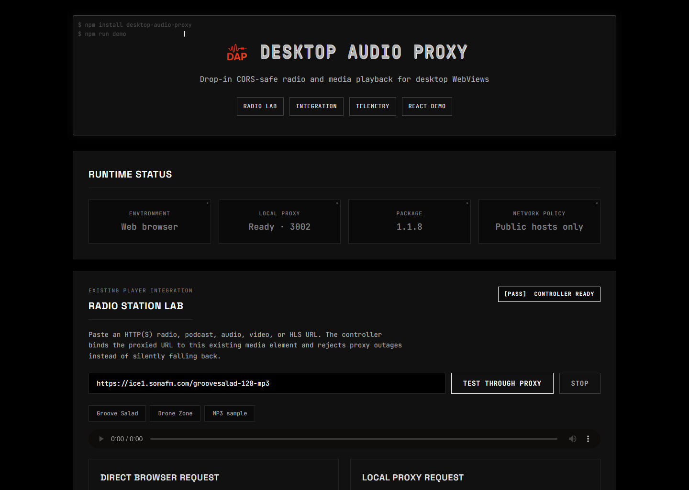
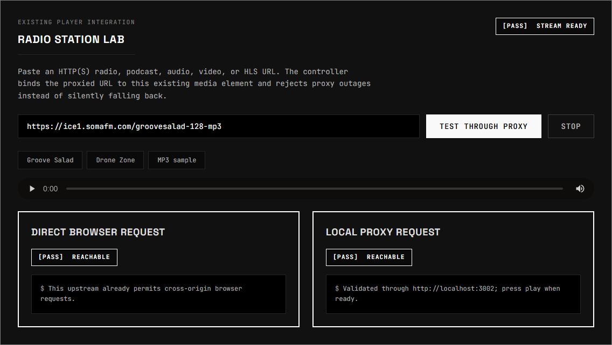
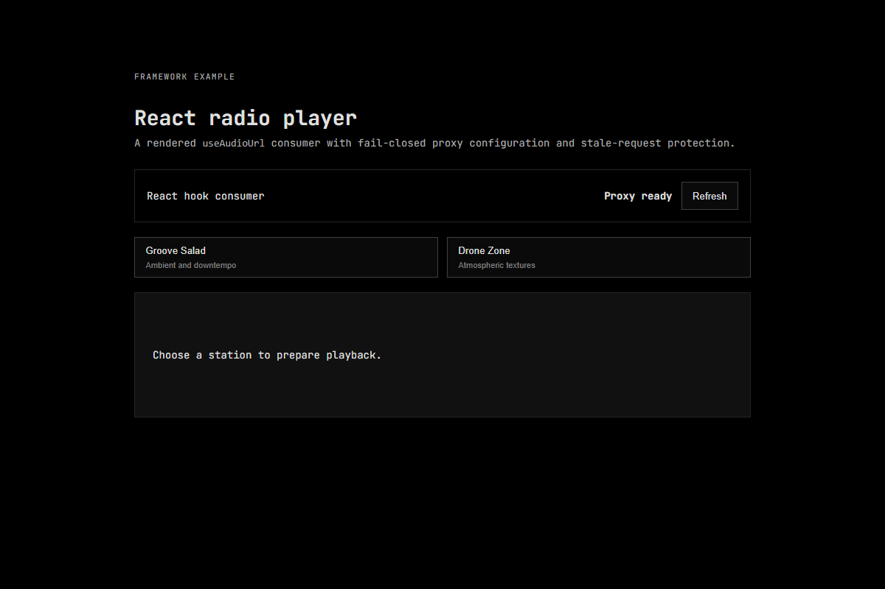
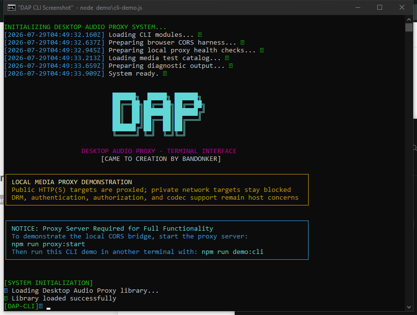
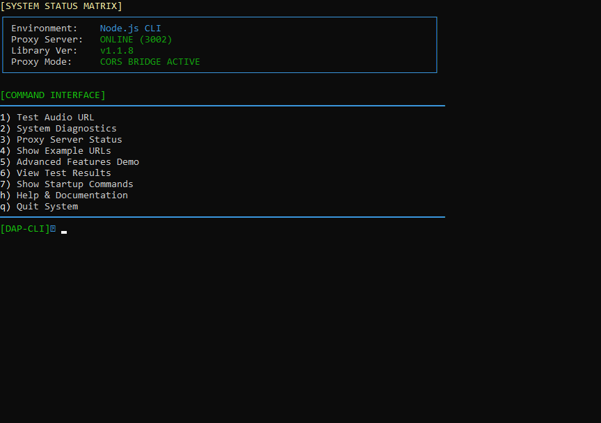
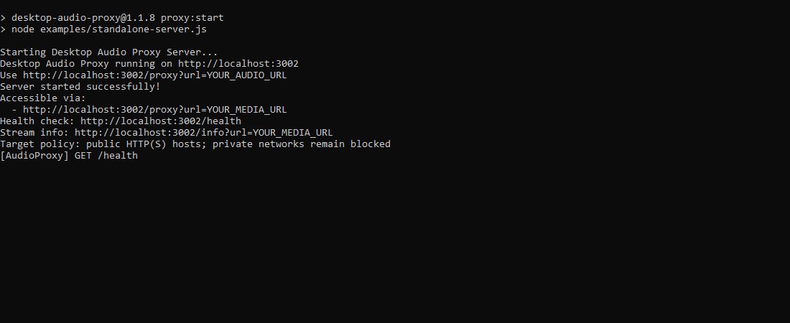

<p align="center">
  
</p>

<h1 align="center">DAP - Desktop Audio Proxy</h1>


<p align="center" style="font-size:1.1em;">
  <strong>Provides a local CORS bridge for audio and video playback in Tauri and Electron apps.</strong>
</p>

<p align="center">
  <a href="https://github.com/Bandonker/desktop-audio-proxy/actions/workflows/ci.yml">
    
  </a>
  <a href="https://www.npmjs.com/package/desktop-audio-proxy">
    
  </a>
  <a href="https://github.com/Bandonker/desktop-audio-proxy/blob/main/LICENSE">
    
  </a>
  
  
  <a href="https://codecov.io/gh/Bandonker/desktop-audio-proxy">
    
  </a>
    <a href="https://ko-fi.com/bandonker">
    
  </a>
  <a href="https://www.buymeacoffee.com/Bandonker">
    
  </a>
  <a href="https://patreon.com/Bandonker">
    
  </a>

</p>


## Features

- **Local CORS Bridge** - Re-serve validated public HTTP(S) media with browser-readable CORS headers
- **Media Transport Proxy** - Byte-transparent transport for common audio/video responses; decoding remains the host runtime's responsibility
- **Auto-Start Proxy** - Start the proxy from the package's Node.js entry point when explicitly enabled
- **Tauri/Electron Adapters** - Browser-side adapters for host-managed proxy processes; native host setup is still required
- **Debug Utility** - Opt-in in-memory, categorized logging for entries your application writes through the debugger API
- **Telemetry System** - Optional performance monitoring and event tracking
- **React/Vue Integration** - Hooks and composables with stale-request protection and cleanup
- **Codec Probing** - `HTMLMediaElement.canPlayType()` checks plus optional host-provided capability data
- **Optional Native Bridges** - Metadata and device information when your Tauri commands or Electron preload API implement them
- **WebKit-Aware Source Selection** - Rank typed fallback sources with the current runtime's `canPlayType()` result
- **WebView Compatibility** - Applies cross-origin, metadata-preload, inline-video, MIME, and range defaults without pretending to transcode
- **Environment Detection** - Automatically detects Tauri, Electron, or web environment
- **Explicit Failure Policy** - Low-level direct-URL fallback is configurable; the media-element controller fails closed by default
- **URL Security Guardrails** - Protocol allowlist and private-network blocking for proxy targets
- **Actionable Error Messages** - Clear error messages with specific steps to fix issues
- **Retry Logic** - Configurable retry attempts with delays
- **Health Monitoring** - Built-in health and info endpoints
- **Stream Lifecycle Hardening** - Conservative cleanup for aborted/closed proxy streams
- **Deterministic Core Tests** - Local upstream mock coverage for info/proxy/timeout paths
- **TypeScript** - Full type safety and IntelliSense support with JSDoc comments
- **Range Requests** - Forward byte ranges for upstream sources that support them
- **Bounded HLS Rewriting** - Rewrite standard playlist, segment, key, and map URIs while enforcing the same destination policy
- **Tree-Shakeable** - Optimized for smaller bundles with dead code elimination
- **Interactive Demo** - Local radio, React, proxy-policy, and telemetry demonstrations

##  Demos

### Web Browser Demo
Visual demonstration of the local CORS bridge in action:

<p align="center">
  
  <br><em>Local 1.1.8 development build showing runtime status and the public-host-only default</em>
</p>

<p align="center">
  
  <br><em>Radio station switching, visible proxy URLs, and explicit stop and cleanup behavior</em>
</p>

<p align="center">
  
  <br><em>React hook integration with a real audio element and live runtime status</em>
</p>

### CLI Terminal Demo
Terminal interface with real CORS checks performed by a Puppeteer-managed
Chromium process:

<p align="center">
  
  <br><em>Current boot sequence and explicit proxy/security boundaries</em>
</p>

<p align="center">
  
  <br><em>Current command menu with package, proxy, environment, and bridge status</em>
</p>

### Proxy Server Integration
Standalone loopback proxy output with runtime port reporting:

<p align="center">
  
  <br><em>Current standalone server output, loopback endpoint, and public-target policy</em>
</p>

> Try it yourself: run `npm run demo` for the self-building web demo. For the
> terminal demo, run `npm run build` first, start `npm run proxy:start` in one
> terminal, then run `npm run demo:cli` in another.

## The Problem

When building desktop applications with web technologies (Tauri, Electron), developers often face:

1. **CORS Issues**: External audio/video URLs (podcasts, radio streams, video content) are blocked due to Cross-Origin Resource Sharing policies
2. **Codec Compatibility**: WebKit, Chromium, and platform media stacks do not decode exactly the same formats
3. **Authentication**: Some media streams require special headers or authentication
4. **Redirects**: Many podcast/streaming/video URLs use multiple redirects that cause issues
5. **HLS/Adaptive Streaming**: M3U8 playlists and adaptive bitrate video may fail to load properly

## The Solution

Desktop Audio Proxy provides:

- **A local CORS bridge** for validated public HTTP(S) audio and video responses
- **Byte-transparent media transport** for formats the receiving runtime can decode
- **Runtime source selection** so a station can offer typed WebKit/Chromium fallbacks
- **Media response normalization** when an upstream labels a known media extension as a generic binary stream
- **Range request forwarding** for upstream sources that honor byte ranges
- **Smart redirect handling** with configurable limits
- **Automatic environment detection** (Tauri/Electron/Web)
- **Optional info endpoint caching** for faster repeated metadata checks
- **Simple API** that works like a drop-in replacement

## Installation

```bash
npm install desktop-audio-proxy
# or
yarn add desktop-audio-proxy
# or
pnpm add desktop-audio-proxy
```

> **Package release:** version `1.1.9` contains
> `createMediaElementController`, `allowedHosts`, and the other documented
> `1.1.8` additions plus the `1.1.9` review fixes. Install that exact version
> with `npm install desktop-audio-proxy@1.1.9`.

### Runtime Requirements

- Node.js `>=14.18` is declared in `engines` because the server's network
  policy uses `node:net` `BlockList`; automated CI currently verifies Node 20,
  22, and 24
- Node.js `>=18` is recommended for built-in `fetch` support
- If you run in Node.js 14.18+/16, provide a global `fetch` polyfill for client health/info checks
- React/Vue entry points require their respective framework in your app (`react` or `vue`)

## Package Exports

This library provides multiple entry points optimized for different environments:

```typescript
// Main entry - includes all functionality (client + server)
import { createAudioClient, startProxyServer } from 'desktop-audio-proxy';

// Browser-only entry - excludes server dependencies for smaller bundles
import {
  createAudioClient,
  createMediaElementController,
  TauriAudioService
} from 'desktop-audio-proxy/browser';

// Server-only entry - for Node.js environments
import { startProxyServer, AudioProxyServer } from 'desktop-audio-proxy/server';
```

**When to use each:**
- **Main (`desktop-audio-proxy`)**: Full-stack applications, development, testing
- **Browser (`/browser`)**: Client-only applications, smaller bundle size needed
- **Server (`/server`)**: Node.js backends, standalone proxy servers, Electron main process

##  Interactive Demo 

**See the current local integration flow in action.** The full demo builds the
workspace, starts a loopback proxy, and serves the browser and React pages:

```bash
npm run demo             # Build React demo bundle + start full demo server on http://localhost:8080
npm run build:react-demo # Rebuild React demo bundle only
npm run demo:serve       # Start static demo server on http://localhost:8080
```

`demo` and `demo:serve` both preserve the legacy example route:
`/examples/react-video-player.tsx` -> `/examples/react-example.tsx`

**Demo Route Map:**
- `/` - Main interactive demo UI
- `/react-player.html` - React demo player page
- `/telemetry-dashboard.html` - Telemetry event viewer
- `/examples/react-example.tsx` - Current React example source
- `/examples/react-video-player.tsx` - Legacy path (302 redirect to `react-example.tsx`)

**Demo Features:**
- **Local Proxy Discovery** - Checks the known local development ports and displays `/health` status
- **Radio Integration Lab** - Exercises fail-closed URL preparation, station switching, stop, and cleanup
- **Direct/Proxy Comparison** - Reports the browser's direct CORS result beside the validated proxy result
- **Security Boundaries** - Separates package behavior from host-owned authentication, DRM, codecs, and process lifecycle
- **React Player Route** - Runs `useAudioUrl` against a real audio element
- **Developer Tools** - Exposes the small test surface at `window.dapDemo`
- **Telemetry Dashboard** - Displays events supplied to the dashboard page; it is separate from the radio lab

**What you can test:**
- **Public HTTP(S) media URLs** - Paste a radio, podcast, audio, video, or HLS URL allowed by the proxy policy
- **Direct versus proxied reachability** - See whether the upstream already permits browser CORS
- **Proxy health and policy** - Confirm the active local port and private-address setting
- **Existing-player integration** - Prepare and stop media on the page's real `<audio>` element
- **React hook behavior** - Switch between the example stations on `/react-player.html`

**Perfect for:**
-  **Evaluating before installing** - See the value immediately
-  **Testing your URLs** - Verify compatibility before integration
-  **Learning the API** - Interactive code examples
-  **Demos and presentations** - Live proof of concept
-  **Debugging integration** - Test with your actual URLs

## CLI Demo 

**Experience the power in your terminal!** Our CLI demo features professional ASCII art and terminal effects:

```bash
npm run build
npm run demo:cli
```

**Features:**
- **Sick ASCII Art** - Matrix-style banner with terminal effects
- **Real-time System Status** - Live proxy detection and version info
- **Audio URL Testing** - Compare direct vs proxy access with detailed analysis
- **System Diagnostics** - Known-port health checks plus package and environment reporting
- **Test Results History** - Track all your URL tests with timestamps
- **Proxy Server Monitoring** - Real-time server status and configuration
- **Interactive Help** - Built-in documentation and examples
- **Command Interface** - Easy-to-use menu system

**CLI Commands:**
```
1) Test Audio URL          - Test a public HTTP(S) media URL allowed by proxy policy
2) System Diagnostics      - Check library capabilities and network
3) Proxy Server Status     - Monitor proxy server health
4) Show Example URLs       - Curated list of test URLs
5) Advanced Features Demo  - List current client methods and host-bridge availability
6) View Test Results       - History of all URL tests
7) Show Startup Commands   - Display setup commands for full demo
h) Help & Documentation    - Learn about the library
q) Quit System            - Exit the CLI
```

**Perfect for:**
- **Quick testing** - Fast audio URL validation
- **Debugging** - Terminal-based diagnostics  
- **Presentations** - Professional CLI aesthetic for demos
- **Headless environments** - No visible browser window is required, but Puppeteer must be able to launch Chromium

## Quick Start

### Browser Client (Proxy Already Running)

```typescript
import { createAudioClient } from 'desktop-audio-proxy/browser';

const audioClient = createAudioClient({
  proxyUrl: 'http://localhost:3002',
  autoDetect: false,
  fallbackToOriginal: false
});

// The host application must already have started the proxy.
const playableUrl = await audioClient.getPlayableUrl('https://example.com/podcast.mp3');
audioElement.src = playableUrl;
```

### With Proxy Server

```typescript
import { startProxyServer, createAudioClient } from 'desktop-audio-proxy';

// Run this in Node.js, such as an Electron main process.
const proxyServer = await startProxyServer({
  host: 'localhost',
  port: 3001,
  allowPrivateAddresses: false
});

const audioClient = createAudioClient({
  proxyUrl: proxyServer.getProxyUrl(),
  autoDetect: false,
  fallbackToOriginal: false
});

const playableUrl = await audioClient.getPlayableUrl('https://example.com/audio.mp3');

// On host shutdown:
await proxyServer.stop();
```

### Existing Radio or Media Player (Recommended)

The media-element controller is the shortest integration path for an existing
`<audio>` or `<video>` player. It handles URL conversion, playback, station
switch races, and cleanup. Unlike the lower-level client, it fails closed by
default instead of silently falling back to a direct URL that may still fail
CORS.

```typescript
import { createMediaElementController } from 'desktop-audio-proxy/browser';

const audio = document.querySelector<HTMLAudioElement>('#radio-player');
if (!audio) throw new Error('Radio player element was not found');

const radio = createMediaElementController(audio, {
  proxyUrl: 'http://localhost:3002',
  retryAttempts: 2
});

await radio.playBest([
  {
    url: 'https://stream.example.com/live.aac',
    type: 'audio/aac',
    codecs: 'mp4a.40.2'
  },
  {
    url: 'https://stream.example.com/live.mp3',
    type: 'audio/mpeg'
  }
]);

// Switching stations is safe even if an older request finishes later.
await radio.play('https://stream.example.com/alternative.aac');

radio.stop();
await radio.dispose(); // also stops a proxy auto-started by this controller
```

`loadBest()` and `playBest()` prefer sources reported as `probably` playable,
then `maybe`, while preserving your order within each result. An untyped URL is
used only as a fallback when no typed candidate is supported. This makes a
station catalog easier to share across WebKit and Chromium without claiming
that DAP can add a missing decoder.

### WebKit Compatibility Scope

The `1.1.8` browser entry adds:

- WebKit, Chromium, and Gecko engine detection, including branded iOS browsers
  that still use WebKit
- source selection through the real media element's `canPlayType()` result
- `crossOrigin = 'anonymous'`, `preload = 'metadata'`, and inline-video defaults
  when the application has not already chosen different values
- media MIME correction for generic `.m3u8`, `.mp3`, `.m4a`, `.aac`, `.wav`,
  and `.mp4` upstream responses
- existing byte-range forwarding and bounded standard-HLS URI rewriting

Local release verification exercises the same renderer in Electron/Chromium,
Tauri/WebView2 on Windows, and Playwright WebKit 26.5. That proves the
integration and transport path in those engines. It is not macOS/iOS WKWebView
certification, and DAP does not provide transcoding, DRM support, or codecs the
host cannot decode.

Start the proxy in Electron's main process, a Node host process, or a
Tauri sidecar. Browser/WebView code cannot start a Node server itself:

```typescript
import { startProxyServer } from 'desktop-audio-proxy/server';

const proxy = await startProxyServer({
  host: 'localhost',
  port: 3002,
  corsOrigins: ['http://localhost:5173'],
  allowedHosts: [
    'stream.example.com',
    '*.trusted-radio-cdn.example'
  ],
  allowPrivateAddresses: false,
  enableLogging: false
});

// On host application shutdown:
await proxy.stop();
```

`allowedHosts` is optional for backward compatibility. When configured, exact
hostnames and boundary-safe `*.example.com` subdomain patterns are enforced on
initial requests and redirects. An explicit empty array denies every target.
HLS stations may use separate CDN hosts for playlists, keys, and segments, so
include each trusted host or CDN suffix used by your station catalog.

### Proxy Endpoint Reference

When the proxy server is running (for example at `http://localhost:3002`):

- `GET /health` - Liveness/config snapshot used by client auto-detection.
- `GET /info?url=<absolute-url>` - Metadata-only upstream check (status, headers, `content-type`, ranges support).
- `GET /proxy?url=<absolute-url>` - Stream endpoint with range support for seeking and CORS headers for browser playback.

URL validation rules:
- `url` must be absolute (`http://` or `https://` by default)
- URL credentials are rejected
- Optional `allowedHosts` rules constrain initial and redirected destinations
- Literal IPs, DNS results, and redirect targets are checked; private, loopback,
  link-local, reserved, and other non-public addresses are blocked by default
- Set `allowPrivateAddresses: true` only for trusted internal media sources

### Video Transport (MP4, M3U8/HLS, WebM)

DAP can proxy video responses with the same URL API. This does not add codecs,
DRM, transcoding, or HLS playback support to the receiving runtime:

```typescript
import { createAudioClient } from 'desktop-audio-proxy';

// Node.js only. Browser/WebView code must use a host-managed proxy.
const audioClient = createAudioClient({
  autoStartProxy: true,
  fallbackToOriginal: false,
  proxyServerConfig: {
    host: 'localhost',
    allowPrivateAddresses: false
  }
});

// MP4 video streaming
const videoUrl = await audioClient.getPlayableUrl('https://example.com/video.mp4');
videoElement.src = videoUrl;

// M3U8/HLS adaptive streaming
const hlsUrl = await audioClient.getPlayableUrl('https://example.com/playlist.m3u8');
videoElement.src = hlsUrl;

// WebM video
const webmUrl = await audioClient.getPlayableUrl('https://example.com/video.webm');
videoElement.src = webmUrl;
```

HLS manifests are bounded to 2 MiB and their relative variant, segment, key,
and map URIs are rewritten through the proxy. Nested playlists therefore retain
the same destination policy as direct proxy requests. The media element or an
HLS playback library must still understand the playlist; third-party HLS
dialects have not been exhaustively validated.

**Transport behavior provided by DAP:**
 - Range request forwarding when the upstream supports ranges
 - M3U8/HLS playlists (master and media playlists)
 - URI rewriting needed by standard adaptive playlists
 - Byte-transparent media delivery; actual codec support depends on the WebView,
   Electron, browser, and operating-system decoder
 - Content-Type preservation plus known-extension correction when an upstream
   returns a generic binary or plain-text type
 - Upstream status and response-header inspection via `/info`

**React Video Example:**

```tsx
import { useAudioUrl } from 'desktop-audio-proxy/react';

function VideoPlayer({ url }) {
  const { playableUrl, loading, error } = useAudioUrl(url, {
    autoStartProxy: true
  });

  if (loading) return <div>Loading video...</div>;
  if (error) return <div>Error: {error.message}</div>;

  return (
    <video controls width="100%">
      <source src={playableUrl} />
    </video>
  );
}
```

## Examples Directory

- **Existing browser player:** [examples/browser-radio-player.ts](examples/browser-radio-player.ts) uses `createMediaElementController` for race-safe station switching and cleanup.
- **React:** [examples/react-example.tsx](examples/react-example.tsx) uses `useAudioUrl` with an actual audio element.
- **Vue:** [examples/vue-example.vue](examples/vue-example.vue) uses `useAudioProxy` with reactive status and retry handling.
- **Desktop shells:** See the Electron and Tauri examples in the complete example list below for their secure process boundaries.

To view the React demo locally with the bundled demo server:

```bash
npm run demo
# then open http://localhost:8080/react-player.html
```

The demo web server also serves source files under `/examples/` (for example,
`http://localhost:8080/examples/react-example.tsx`).

## Migration Notes

Recent non-breaking compatibility updates:

- **React example path rename**: `examples/react-video-player.tsx` was replaced by `examples/react-example.tsx`.
  - Compatibility route is supported in demo servers: `/examples/react-video-player.tsx` redirects to `/examples/react-example.tsx`.
- **Client option rename**: `proxyConfig` was replaced by `proxyServerConfig`.
  - Use `proxyServerConfig` in all new code and docs examples.

## Security Defaults (Recommended Baseline)

These defaults are intentionally conservative. Keep them unless you have a trusted internal-network use case:

- `allowedProtocols: ['http', 'https']` (rejects other protocols)
- `allowedHosts` omitted by default; configure exact station hosts or
  `*.trusted-cdn.example` patterns for a curated catalog
- `allowPrivateAddresses: false` (checks literal, DNS-resolved, and redirect targets to reduce SSRF risk)
- `maxRedirects: 10` (limits redirect-chain abuse)
- `timeout: 60000` (bounds long-running upstream requests)
- `maxCacheEntries: 256` (bounds the in-memory metadata cache)
- `host: 'localhost'` by default (proxy is local-only unless you explicitly change it)

Production recommendations:

- Keep `allowPrivateAddresses` disabled unless you explicitly need private-network media sources.
- Restrict `corsOrigins` to your known app origin(s) instead of `'*'` in production.
- Keep `enableLogging` off in production unless actively debugging.
- Review and follow `SECURITY.md` before exposing a proxy beyond local development.


### Tauri Integration

```typescript
import { createMediaElementController } from 'desktop-audio-proxy/browser';

// Implement this as a narrow trusted Tauri command after starting your sidecar.
const proxyUrl = await getProxyUrlFromTauriHost();

const radio = createMediaElementController(audioElement, {
  proxyUrl,
  autoDetect: false,
  autoStartProxy: false,
  fallbackToOriginal: false
});

await radio.load(originalUrl);

// On component/window teardown:
await radio.dispose();
```

The package does not start a Node process from a Tauri WebView. Your Tauri host
must start and stop a sidecar or equivalent local service, then expose only the
resulting proxy URL through a narrow command. See
[`examples/tauri-integration.js`](examples/tauri-integration.js).
The repository also contains a minimal compiled Tauri 2 smoke host under
`test/native/tauri`; it is a verification fixture, not code shipped in the npm
package.

### Auto-Start Proxy (Node.js Only)

No need to manually start a proxy server - just enable `autoStartProxy` and the library handles it for you:

```typescript
import { createAudioClient } from 'desktop-audio-proxy';

const audioClient = createAudioClient({
  autoStartProxy: true, // Automatically starts proxy when needed
  fallbackToOriginal: false,
  proxyServerConfig: {
    host: 'localhost',
    port: 3002,
    corsOrigins: ['http://localhost:5173'],
    allowPrivateAddresses: false,
    enableLogging: false
  }
});

// That's it! The proxy starts automatically when needed
const playableUrl = await audioClient.getPlayableUrl('https://example.com/audio.mp3');

// Clean up during application shutdown
await audioClient.stopProxyServer();
```

**How it works:**
1. Client checks if proxy server is available
2. If not available and `autoStartProxy` is enabled, starts proxy automatically
3. Only happens in Node.js environments (browser-safe)
4. Your application calls `stopProxyServer()` during shutdown to release the
   socket and permanently prevent that client instance from auto-starting
   another server; create a new client if auto-start is needed again

### Electron Integration

Start the proxy in Electron's main process, expose only `getProxyUrl()` through
a context-isolated preload bridge, and use the media-element controller in the
renderer. The complete three-file boundary is shown in
[`electron-integration.js`](examples/electron-integration.js),
[`electron-preload.cjs`](examples/electron-preload.cjs), and
[`electron-renderer.ts`](examples/electron-renderer.ts).
The context-isolated runtime fixture under `test/native/electron` verifies the
renderer/proxy/media path without enabling Node integration.

## Advanced Configuration

```typescript
const audioClient = createAudioClient({
  proxyUrl: 'http://localhost:3002',
  autoDetect: true,
  // Recommended for curated desktop media: surface proxy failures.
  fallbackToOriginal: false,
  retryAttempts: 3,
  retryDelay: 1000,
  
  // Optional proxy server config
  proxyServerConfig: {
    host: 'localhost',
    port: 3002,
    corsOrigins: ['http://localhost:5173'],
    timeout: 60000,
    maxRedirects: 20,
    allowedProtocols: ['http', 'https'],
    allowedHosts: ['stream.example.com', '*.trusted-radio-cdn.example'],
    allowPrivateAddresses: false,
    enableLogging: false,
    cacheEnabled: true,
    cacheTTL: 3600,
    maxCacheEntries: 256
  }
});
```

## Debugging

The debugger is an opt-in categorized log store. It records entries written
through the debugger instance; it does not automatically intercept the
package's existing `console` messages:

```typescript
import { enableDebug, getDebugger } from 'desktop-audio-proxy';

// Quick enable with defaults
const debug = enableDebug('debug');

debug.info('client', 'Preparing station', { stationId: 'groove-salad' });

// The same singleton can be retrieved elsewhere.
const debugger = getDebugger();

// View logs
console.log(debugger.getLogs());

// Export logs for bug reports
const logsJson = debugger.exportLogs();

// Get statistics
debugger.printStats();

// Turn it off when done
import { disableDebug } from 'desktop-audio-proxy';
disableDebug();
```

**Available category labels:**
- `client` - Client initialization and URL processing
- `server` - Proxy server operations
- `proxy` - Proxy request/response handling
- `environment` - Environment detection (Tauri/Electron/Web)
- `performance` - Performance metrics and timing
- `network` - Network requests and responses
- `tauri` - Tauri-specific operations
- `electron` - Electron-specific operations

**Log Levels:**
- `debug` - Everything (verbose)
- `info` - General information
- `warn` - Warnings
- `error` - Errors only

**Custom Log Handler:**
```typescript
import { getDebugger } from 'desktop-audio-proxy';

const debugger = getDebugger({
  enabled: true,
  level: 'debug',
  onLog: (entry) => {
    // Send to your analytics, crash reporting, etc.
    myLogger.log(entry);
  }
});
```

## Telemetry

Track client lifecycle, proxy checks, URL conversion, errors, and measured
operation durations with the optional telemetry callback. Events stay inside
your process unless your callback sends them elsewhere.

### Basic Setup

```typescript
import { createAudioClient } from 'desktop-audio-proxy';

const audioClient = createAudioClient({
  telemetry: {
    enabled: true,
    trackPerformance: true,
    trackErrors: true,
    onEvent: (event) => {
      console.log('Telemetry Event:', event);
      // event contains: type, timestamp, data
    }
  }
});
```

### Event Types

**proxy_check** - Fired when checking if proxy server is available
```javascript
{
  type: 'proxy_check',
  timestamp: 1761065276620,
  data: {
    available: true,
    proxyUrl: 'http://localhost:3002'
  }
}
```

**url_conversion** - Fired when converting a URL to playable format
```javascript
{
  type: 'url_conversion',
  timestamp: 1761065276620,
  data: {
    url: 'https://example.com/audio.mp3',
    result: 'http://localhost:3002/proxy?url=...',
    type: 'proxy',
    success: true,
    attempt: 1
  }
}
```

**performance** - Fired for operation timing measurements
```javascript
{
  type: 'performance',
  timestamp: 1761065276620,
  data: {
    label: 'url_conversion',
    duration: 51,
    url: 'https://example.com/audio.mp3'
  }
}
```

**error** - Fired when an error occurs
```javascript
{
  type: 'error',
  timestamp: 1761065276620,
  data: {
    error: 'Proxy server unavailable',
    context: 'url_conversion'
  }
}
```

### Sending Events Elsewhere

The callback runs synchronously. Queue remote analytics work and review event
data for your privacy requirements before sending it:

```typescript
const audioClient = createAudioClient({
  telemetry: {
    enabled: true,
    trackPerformance: true,
    trackErrors: true,
    onEvent: (event) => {
      queueMicrotask(() => {
        analytics.track('desktop_audio_proxy', {
          type: event.type,
          duration: event.data?.duration
        });
      });
    }
  }
});
```

### Metrics You Can Track

- **Success Rate** - Percentage of successful URL conversions
- **Operation Duration** - Timing emitted for instrumented client operations
- **Error Rate** - How often conversions fail
- **Proxy Availability** - Results of client health checks
- **Requested Sources** - Only if your application intentionally retains the diagnostic URL data

### Privacy and Performance

Telemetry is optional and disabled by default. The callback is synchronous, so
its cost depends on your handler. Keep it small, avoid logging private station
URLs or user data, and queue network delivery outside the callback.

## Framework Integration

### React Hooks

React integration with loading, error, retry, stale-result, and cleanup state:

```jsx
import { useAudioProxy, useAudioCapabilities } from 'desktop-audio-proxy/react';

function AudioPlayer({ url }) {
  const { audioUrl, isLoading, error, retry } = useAudioProxy(url, {
    proxyUrl: 'http://localhost:3002',
    autoDetect: false,
    fallbackToOriginal: false
  });
  const { capabilities } = useAudioCapabilities();
  
  if (isLoading) return <div>Loading...</div>;
  if (error) return <div>Error: {error} <button onClick={retry}>Retry</button></div>;
  
  return <audio controls src={audioUrl} />;
}

```

`AudioProxyProvider` exposes a shared client through
`useAudioProxyContext()`. `useAudioProxy()` does not currently inherit provider
defaults, so pass its options directly as shown above:

```jsx
import {
  AudioProxyProvider,
  useAudioProxyContext
} from 'desktop-audio-proxy/react';

function ActiveProxy() {
  const { client } = useAudioProxyContext();
  return <code>{client.getProxyUrl()}</code>;
}

function App() {
  return (
    <AudioProxyProvider options={{
      proxyUrl: 'http://localhost:3002',
      fallbackToOriginal: false
    }}>
      <ActiveProxy />
    </AudioProxyProvider>
  );
}
```

**Available React Hooks:**
- `useAudioProxy(url)` - Complete audio URL processing with loading states
- `useAudioCapabilities()` - Browser codec probing plus optional host-provided device/system data
- `useProxyStatus()` - Real-time proxy server monitoring
- `useAudioMetadata(filePath)` - Host-provided metadata bridge for Tauri/Electron

### Vue Composables

Modern Vue 3 Composition API integration:

```vue
<script setup>
import { ref } from 'vue';
import { useAudioProxy, useAudioCapabilities } from 'desktop-audio-proxy/vue';

const url = ref('https://example.com/audio.mp3');
const { audioUrl, isLoading, error, retry } = useAudioProxy(url, {
  proxyUrl: 'http://localhost:3002',
  autoDetect: false,
  fallbackToOriginal: false
});
const { capabilities } = useAudioCapabilities();
</script>

<template>
  <div v-if="isLoading">Loading...</div>
  <div v-else-if="error">
    Error: {{ error }} 
    <button @click="retry">Retry</button>
  </div>
  <audio v-else controls :src="audioUrl" />
</template>
```

**Available Vue Composables:**
- `useAudioProxy(url)` - Reactive audio URL processing with Vue refs
- `useAudioCapabilities()` - Reactive browser codec probing plus optional host data
- `useProxyStatus()` - Reactive proxy server status monitoring
- `useAudioMetadata(filePath)` - Reactive host-provided metadata bridge

### Vue Plugin Pattern

For app-wide injection (instead of creating a client in each component):

```ts
import { createApp } from 'vue';
import { createAudioProxy } from 'desktop-audio-proxy/vue';
import App from './App.vue';

const app = createApp(App);

app.use(
  createAudioProxy({
    defaultOptions: {
      proxyUrl: 'http://localhost:3002',
      retryAttempts: 3,
      fallbackToOriginal: false
    }
  })
);

app.mount('#app');
```

Then inside a component/composable, use `useGlobalAudioProxy()` to access the injected shared client.

## API Reference

### AudioProxyClient

```typescript
class AudioProxyClient {
  constructor(options?: AudioProxyOptions);
  
  // Core Methods
  getPlayableUrl(url: string): Promise<string>;
  canPlayUrl(url: string): Promise<StreamInfo>;
  getEnvironment(): Environment;
  isProxyAvailable(): Promise<boolean>;
  getProxyUrl(): string;

  // Lifecycle
  stopProxyServer(): Promise<void>;
}
```

### MediaElementController

```typescript
interface MediaElementController {
  // Returns null when superseded by a newer load/play/stop request.
  load(url: string): Promise<string | null>;
  play(url: string): Promise<string | null>;
  stop(): void;
  dispose(): Promise<void>;
}

function createMediaElementController(
  element: HTMLMediaElement,
  options?: AudioProxyOptions
): MediaElementController;

// Detect the current engine and choose among typed fallback sources
function detectMediaEngine(userAgent?: string): MediaEngine;
function selectPlayableMediaSource(
  element: HTMLMediaElement,
  candidates: readonly MediaSourceCandidate[]
): MediaSourceCandidate;
```

The controller uses `fallbackToOriginal: false` unless explicitly overridden.
After `dispose()`, new load or play requests are rejected.

### TauriAudioService

```typescript
class TauriAudioService {
  constructor(options?: AudioServiceOptions);
  
  // URL Processing
  getStreamableUrl(url: string): Promise<string>;
  canPlayStream(url: string): Promise<StreamInfo>;
  
  // Environment / Health
  getEnvironment(): Environment;
  isProxyAvailable(): Promise<boolean>;
  
  // Browser codec probing plus optional Tauri command data
  checkSystemCodecs(): Promise<{
    supportedFormats: string[];
    missingCodecs: string[];
    capabilities: Record<string, string>;
  }>;
  getAudioMetadata(filePath: string): Promise<{
    duration?: number;
    bitrate?: number;
    sampleRate?: number;
    channels?: number;
    format?: string;
  } | null>;
  getAudioDevices(): Promise<{
    inputDevices: Array<{ id: string; name: string }>;
    outputDevices: Array<{ id: string; name: string }>;
  } | null>;
}
```

### ElectronAudioService

```typescript
class ElectronAudioService {
  constructor(options?: AudioServiceOptions);
  
  // URL Processing
  getStreamableUrl(url: string): Promise<string>;
  canPlayStream(url: string): Promise<StreamInfo>;
  
  // Environment / Health
  getEnvironment(): Environment;
  isProxyAvailable(): Promise<boolean>;
  
  // Browser codec probing plus optional Electron preload data
  checkSystemCodecs(): Promise<{
    supportedFormats: string[];
    missingCodecs: string[];
    capabilities: Record<string, string>;
  }>;
  getAudioMetadata(filePath: string): Promise<{
    duration?: number;
    bitrate?: number;
    sampleRate?: number;
    channels?: number;
    format?: string;
  } | null>;
  getAudioDevices(): Promise<{
    inputDevices: Array<{ id: string; name: string }>;
    outputDevices: Array<{ id: string; name: string }>;
  } | null>;
  getSystemAudioSettings(): Promise<{
    defaultInputDevice?: string;
    defaultOutputDevice?: string;
    masterVolume?: number;
  } | null>;
}
```

`checkSystemCodecs()` always has the browser's `canPlayType()` result.
`getAudioMetadata()`, `getAudioDevices()`, Electron system settings, and the
extra native capability data require commands or preload methods implemented
by your host application. This package defines and calls those bridges; it does
not ship the native metadata extractor or device enumerator itself.

### AudioProxyServer

```typescript
class AudioProxyServer {
  constructor(config?: ProxyConfig);
  
  // Server Management
  start(): Promise<void>;
  stop(): Promise<void>;
  
  // Runtime Info
  getActualPort(): number;
  getProxyUrl(): string;
}
```

### Factory Functions

```typescript
// Create audio client with auto-detection
function createAudioClient(options?: AudioProxyOptions): AudioProxyClient;

// Create and start proxy server
function startProxyServer(config?: ProxyConfig): Promise<AudioProxyServer>;

// Create server instance without starting
function createProxyServer(config?: ProxyConfig): AudioProxyServer;

// Bind proxy URL resolution and lifecycle to an existing audio/video element
function createMediaElementController(
  element: HTMLMediaElement,
  options?: AudioProxyOptions
): MediaElementController;
```

## Testing

### Running Tests

```bash
# Run test suite
npm test

# Run tests in watch mode during development
npm run test:watch

# Generate coverage report
npm run test:coverage

# Verify package exports and server startup helpers
npm run verify:exports

# Compile the public declarations as a strict NodeNext consumer
npm run verify:types

# Compile and smoke-check every integration example
npm run verify:examples

# Check README example references and local links
npm run verify:docs

# Smoke test demo routes (includes legacy redirect checks)
npm run test:demo-smoke

# Build and launch the context-isolated Electron host
npm run test:native:electron

# Compile and launch the Tauri 2 host (requires Rust/Cargo and WebView2)
npm run test:native:tauri

# Run the engine-level Playwright WebKit media/range smoke
# First-time setup: npx playwright install webkit
npm run test:webkit

# Build and run all tests
npm run test:all
```

## Examples

### Standalone Server

You can run a standalone proxy server using the included example:

```bash
# Build the ignored/generated dist output first
npm run build

# Start standalone proxy server
npm run proxy:start

# Or run the example directly
node examples/standalone-server.js
```

### Complete Integration Examples

The `examples/` directory contains focused integrations for the supported app
styles and desktop security boundaries:

- **[`browser-radio-player.ts`](examples/browser-radio-player.ts)** - Drop-in controller for an existing `<audio>` player
- **[`react-example.tsx`](examples/react-example.tsx)** - React hook integration with loading, retry, and playback state
- **[`vue-example.vue`](examples/vue-example.vue)** - Vue composable integration with reactive status
- **[`standalone-server.js`](examples/standalone-server.js)** - Local-only standalone proxy server configuration
- **[`video-streaming.js`](examples/video-streaming.js)** - Video, range request, and HLS usage
- **[`electron-integration.js`](examples/electron-integration.js)** - Electron main-process proxy lifecycle
- **[`electron-preload.cjs`](examples/electron-preload.cjs)** - Narrow context-isolated preload bridge
- **[`electron-renderer.ts`](examples/electron-renderer.ts)** - Renderer-side controller and cleanup
- **[`tauri-integration.js`](examples/tauri-integration.js)** - Tauri frontend and sidecar lifecycle boundary

The server examples keep the proxy on localhost, restrict browser origins, and
show `allowedHosts` for curated station catalogs. Add every trusted playlist,
segment, key, or CDN host used by your media sources.

## Troubleshooting

### Common Issues

1. **"Media format not supported"**: Verify source codec support in your runtime (WebView/Electron/OS codecs)
2. **"CORS error"**: Ensure the proxy server is running
3. **"Connection refused"**: Check if the proxy port is available

### Debug Mode

```typescript
import {
  createAudioClient,
  enableDebug,
  TauriAudioService,
  ElectronAudioService
} from 'desktop-audio-proxy';

const audioClient = createAudioClient();

// Enable the debugger store, then write categorized application entries.
if (process.env.NODE_ENV === 'development') {
  const debug = enableDebug('debug');
  debug.info('client', 'Inspecting runtime capabilities');
}

// Browser codec probing works directly. Extra native results require your
// Tauri commands or Electron preload bridge.
const environment = audioClient.getEnvironment();
if (environment === 'tauri') {
  const service = new TauriAudioService();
  const codecInfo = await service.checkSystemCodecs();
  console.log('Supported codecs:', codecInfo);
} else if (environment === 'electron') {
  const service = new ElectronAudioService();
  const codecInfo = await service.checkSystemCodecs();
  console.log('Supported codecs:', codecInfo);
}
```

### Using the Interactive Demo for Debugging

The included demo is perfect for debugging integration issues:

```bash
# Full demo experience (web + proxy + examples)
npm run demo

# Static demo only (useful for UI checks)
npm run build:react-demo
npm run demo:serve

# Terminal demo with ASCII art + diagnostics
npm run build
npm run demo:cli
```

## Development

### Build System

The project uses Rollup for multi-target builds:

```bash
# Build all variants (ESM + CJS for each entry point)
npm run build

# Development build with watch mode
npm run dev
```

**Build Outputs:**
- `dist/index.{esm.js,cjs}` - Main entry with all features
- `dist/browser.{esm.js,cjs}` - Browser-optimized (no Node.js deps)
- `dist/server.{esm.js,cjs}` - Server-only functionality
- `dist/react.{esm.js,cjs}` - React hooks entry
- `dist/vue.{esm.js,cjs}` - Vue composables entry
- `dist/*.d.ts` - TypeScript definitions for all variants

### Project Structure

```text
src/
|-- index.ts            # Main exports (client + server)
|-- browser.ts          # Browser-safe exports only
|-- server.ts           # Server-only exports
|-- client.ts           # AudioProxyClient implementation
|-- server-impl.ts      # AudioProxyServer implementation
|-- media-element.ts    # Existing-player controller and lifecycle
|-- media-compatibility.ts # Runtime engine and source selection
|-- tauri-service.ts    # Tauri-specific service
|-- electron-service.ts # Electron-specific service
|-- react.ts            # React hooks entry
|-- vue.ts              # Vue composables entry
|-- types.ts            # TypeScript type definitions
`-- __tests__/          # Jest test suites
```

### Release Checklist

Before publishing a release:

```bash
npm run lint
npm run build
npm test -- --runInBand
npm run verify:exports
npm run verify:types
npm run verify:examples
npm run verify:docs
npm run build:react-demo
npm run test:demo-smoke
npm run verify:package
npm run test:native:electron
npm run test:native:tauri
npm run test:webkit
npm pack --dry-run
```

The native commands are Windows release gates here. A macOS WKWebView run is a
separate platform-certification gate, not implied by the WebKit engine smoke.

The publish workflow uses npm Trusted Publishing (OIDC), so it does not need an
`NPM_TOKEN` secret or a write token in this repository. In the npm package
settings, configure the GitHub Actions trusted publisher for user `Bandonker`,
repository `desktop-audio-proxy`, and workflow filename `publish.yml`. Leave the
environment blank unless the workflow is later assigned a matching GitHub
environment.

### Contributing

```bash
git clone https://github.com/bandonker/desktop-audio-proxy
cd desktop-audio-proxy
npm install
npm run build
npm test
```

## License

MIT License - see [LICENSE](LICENSE) for details.

<div align="center">
  <sub>MIT - Bandonker</sub>
</div>

## Additional Documentation

- [SECURITY.md](SECURITY.md) - Security best practices and vulnerability reporting
- [TAURI_MIGRATION.md](TAURI_MIGRATION.md) - Guide for migrating from Tauri v1 to v2

<div align="center">
  <sub>Made with &#10084;&#65039; by Bandonker</sub>
</div>
